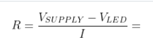

# Lab 2: MASAUSO LUNGU

Link to My `Digital-electronics-2` GitHub repository:

   [https://github.com/...](https://github.com/...)

## Preparation tasks (done before the lab at home)

1. Draw two basic ways to connect a LED to the output pin of the microcontroller: LED active-low, LED active-high.

&nbsp;
 

&nbsp;

&nbsp;
&nbsp;

&nbsp;

&nbsp;

2. [Calculate LED resistor value](https://electronicsclub.info/leds.htm) for typical red and blue LEDs.

&nbsp;

&nbsp;

| **LED color** | **Supply voltage** | **LED current** | **LED voltage** | **Resistor value** |
| :-: | :-: | :-: | :-: | :-: |
| red | 5&nbsp;V | 20&nbsp;mA | 2.0 V | 150 |
| blue | 5&nbsp;V | 20&nbsp;mA | 3.2 V | 90 |


3. Draw the basic ways to connect a push button to the microcontroller input pin: button active-low, button active-high.

&nbsp;
 
&nbsp;

&nbsp;
 
&nbsp;

&nbsp;

&nbsp;


### Active-low and active-high LEDs

1. Complete tables according to the AVR manual.

| **DDRB** | **Description** |
| :-: | :-- |
| 0 | Input pin |
| 1 | Output pin|

| **PORTB** | **Description** |
| :-: | :-- |
| 0 | Output low value |
| 1 | Output high value|

| **DDRB** | **PORTB** | **Direction** | **Internal pull-up resistor** | **Description** |
| :-: | :-: | :-: | :-: | :-- |
| 0 | 0 | input | no | Tri-state, high-impedance |
| 0 | 1 | Input  | Yes | Pxn will source current if ext. pulled low |
| 1 | 0 | Output | No | Output low (sink) |
| 1 | 1 | Output | No | Output high (source) |

### AVAILABLE PINs on ATMEGA328P
| **Port** | **Pin** | **Input/output usage?** |
| :-: | :-: | :-- |
| A | x | Microcontroller ATmega328P does not contain port A |
| B | 0 | Yes (Arduino pin 8) |
|   | 1 | Yes (Arduino pin 9) |
|   | 2 | Yes (Arduino pin 10) |
|   | 3 | Yes (Arduino pin 11) |
|   | 4 | Yes (Arduino pin 12) |
|   | 5 | Yes (Arduino pin 13) |
|   | 6 | N/A |
|   | 7 | N/A |
| C | 0 | Yes (Arduino pin A0) |
|   | 1 | Yes (Arduino pin A1) |
|   | 2 | Yes (Arduino pin A2) |
|   | 3 | Yes (Arduino pin A3) |
|   | 4 | Yes (Arduino pin A4) |
|   | 5 | Yes (Arduino pin A5) |
|   | 6 | N/A |
|   | 7 | N/A |
| D | 0 | Yes (Arduino pin RX<-0) |
|   | 1 | Yes (Arduino pin TX->1) |
|   | 2 | Yes (Arduino pin 2) |
|   | 3 | Yes (Arduino pin ~3) |
|   | 4 | Yes (Arduino pin 4) |
|   | 5 | Yes (Arduino pin ~5) |
|   | 6 | Yes (Arduino pin ~6) |
|   | 7 | Yes (Arduino pin 7 |

2. Part of the C code listing with syntax highlighting, which blinks alternately with a pair of LEDs; let one LED is connected to port B and the other to port C:

```c
/* Defines -----------------------------------------------------------*/
#define LED_GREEN   PB5     // AVR pin where green LED is connected
#define LED_RED     PC0
#define BTN         PD7
#define BLINK_DELAY 200
#ifndef F_CPU
# define F_CPU 16000000     // CPU frequency in Hz required for delay
#endif

/* Includes ----------------------------------------------------------*/
#include <util/delay.h>     // Functions for busy-wait delay loops
#include <avr/io.h>         // AVR device-specific IO definitions

/* Functions ---------------------------------------------------------*/
/**********************************************************************
 * Function: Main function where the program execution begins
 * Purpose:  Toggle two LEDs when a push button is pressed.
 * Returns:  none
 **********************************************************************/
int main(void)
{
    // Green LED at port B
    // Set pin as output in Data Direction Register...
    DDRB = DDRB | (1<<LED_GREEN);
    // ...and turn LED off in Data Register
    PORTB = PORTB & ~(1<<LED_GREEN);

    // Configuring LED_RED at port C
	DDRC = DDRC | (1<<LED_RED);
	PORTC = PORTC |(1<<LED_RED);

	while(1)
	{
		_delay_ms(BLINK_DELAY);
		PORTB = PORTB ^ (1<<LED_GREEN);
		PORTC = PORTC ^ (1<<LED_RED);
	}
 

    // Will never reach this
    return 0;
}

```


### Push button

1. Part of the C code listing with syntax highlighting, which toggles LEDs only if push button is pressed. Otherwise, the value of the LEDs does not change. Let the push button is connected to port D:

```c
   /* Defines -----------------------------------------------------------*/
#define LED_GREEN   PB5     // AVR pin where green LED is connected
#define LED_RED     PC0
#define PUSH_BTN    PD0
#define BLINK_DELAY 100
#ifndef F_CPU
# define F_CPU 16000000     // CPU frequency in Hz required for delay
#endif

/* Includes ----------------------------------------------------------*/
#include <util/delay.h>     // Functions for busy-wait delay loops
#include <avr/io.h>         // AVR device-specific IO definitions
#include <avr/sfr_defs.h>


/* Functions ---------------------------------------------------------*/
/**********************************************************************
 * Function: Main function where the program execution begins
 * Purpose:  Toggle two LEDs when a push button is pressed.
 * Returns:  none
 **********************************************************************/
int main(void)
{
    // Green LED at port B
    // Set pin as output in Data Direction Register...
    DDRB = DDRB | (1<<LED_GREEN);
    // ...and turn LED off in Data Register
    PORTB = PORTB & ~(1<<LED_GREEN);

	// Configure the second LED at port C
	DDRC = DDRC | (1<<LED_RED);
	PORTC = PORTC | (1<<LED_RED);

    // Configure Push button at port D and enable internal pull-up resistor
	DDRD = DDRD & ~(1<<PUSH_BTN);
	PORTD = PORTD | (1<<PUSH_BTN);
	
	while(1)
	{ 
		
		_delay_ms(BLINK_DELAY);
		
		if (bit_is_clear(PIND, PUSH_BTN))
		{
			PORTB = PORTB ^ (1<<LED_GREEN);
			PORTC = PORTC ^ (1<<LED_RED);
		}
	}
 

    // Will never reach this
    return 0;
}

```


### Knight Rider

1. Scheme of Knight Rider application, i.e. connection of AVR device, five LEDs, resistors, one push button, and supply voltage. The image can be drawn on a computer or by hand. Always name all components and their values!

   