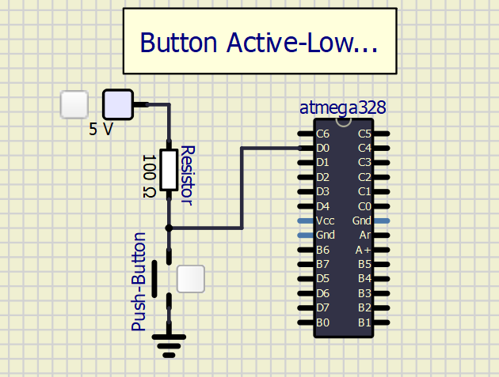

# Lab 2: Control of GPIO, LED, push butt

### Learning objectives

  * Use LEDs and push buttons
  * Config input/output ports of AVR using control registers
  * Use ATmega328P manual and find information
  * Use breadboard and connect electronic devices to AVR pins

The purpose of this laboratory exercise is to learn how to use basic input/output devices such as LEDs (Light Emitting Diodes) and push buttons, and how to control GPIO (General Purpose Input Output) pins with help of control registers.


### Table of contents

<a name="preparation"></a>
## Preparation tasks (done before the lab at home)

1. Draw two basic ways to connect a LED to the output pin of the microcontroller: LED active-low, LED active-high.

&nbsp;
 

&nbsp;

&nbsp;
&nbsp;

&nbsp;

&nbsp;

2. [Calculate LED resistor value](https://electronicsclub.info/leds.htm) for typical red and blue LEDs.

&nbsp;

&nbsp;

| **LED color** | **Supply voltage** | **LED current** | **LED voltage** | **Resistor value** |
| :-: | :-: | :-: | :-: | :-: |
| red | 5&nbsp;V | 20&nbsp;mA | 2.0 V | 150 |
| blue | 5&nbsp;V | 20&nbsp;mA | 3.2 V | 90 |

> Note that, equation was generated by [Online LaTeX Equation Editor](https://www.codecogs.com/latex/eqneditor.php) using the following code.
```LaTeX
R = \frac{V_{SUPPLY}-V_{LED}}{I} =
```
>

3. Draw the basic ways to connect a push button to the microcontroller input pin: button active-low, button active-high.

&nbsp;
 
&nbsp;

&nbsp;
 
&nbsp;

&nbsp;

&nbsp;
