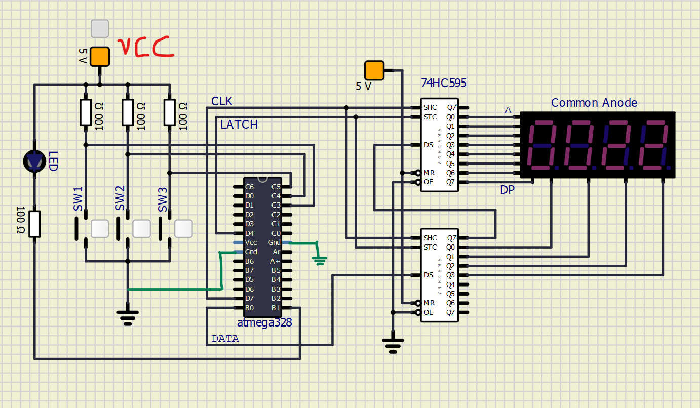

# Lab 5: Masauso Lungu

Link to my `Digital-electronics-2` GitHub repository:

[https://github.com/Masauso-L/Digital-electronis-2/tree/main/Labs/05-segment](https://github.com/Masauso-L/Digital-electronis-2/tree/main/Labs/05-segment)


## 7-segment library

1. In your words, describe the difference between Common Cathode and Common Anode 7-segment display.
   * CC SSD: Have all of their segments' cathodes connected to a common ground, the respective anodes connected to individual pins i.e. Active high
   
   * CA SSD: Have all of their segments' anodes connected to a common source, the respective cathodes connected to individual pins i.e. Active low


2. Code listing with syntax highlighting of two interrupt service routines (`TIMER1_OVF_vect`, `TIMER0_OVF_vect`) from counter application with at least two digits, ie. values from 00 to 59:

```c
/**********************************************************************
 * Function: Timer/Counter1 overflow interrupt
 * Purpose:  Increment counter value from 00 to 59.
 **********************************************************************/
ISR(TIMER1_OVF_vect)
{
    // WRITE YOUR CODE HERE
    cnt++;         //global variable defined elsewhere i.e: volatile uint8_t cnt = 0;
	if (cnt > 59) 
	{
		cnt = 0;
	}

}
```

```c
/**********************************************************************
 * Function: Timer/Counter0 overflow interrupt
 * Purpose:  Display tens and units of a counter at SSD.
 **********************************************************************/
ISR(TIMER0_OVF_vect)
{
    static uint8_t pos = 0;

    // WRITE YOUR CODE HERE
	uint8_t ones;
	uint8_t tens;
	
	tens = cnt /10;
	ones = cnt % 10;
	
	if(pos == 0) SEG_update_shift_regs(ones, 0);
	if(pos == 1) SEG_update_shift_regs(tens, 1);
	if(pos == 2) SEG_update_shift_regs(0, 2);
	if(pos == 3) SEG_update_shift_regs(0, 3);
	
	pos++;
	if(pos == 4) pos = 0;

}
```

3. Flowchart figure for function `SEG_clk_2us()` which generates one clock period on `SEG_CLK` pin with a duration of 2&nbsp;us. The image can be drawn on a computer or by hand. Use clear descriptions of the individual steps of the algorithms.

   

`*for unknown reasons the figure has been flipped to landscape orientation upon conversion to pdf`


## Kitchen alarm

Consider a kitchen alarm with a 7-segment display, one LED and three push buttons: start, +1 minute, -1 minute. Use the +1/-1 minute buttons to increment/decrement the timer value. After pressing the Start button, the countdown starts. The countdown value is shown on the display in the form of mm.ss (minutes.seconds). At the end of the countdown, the LED will start blinking.

1. Scheme of kitchen alarm; do not forget the supply voltage. The image can be drawn on a computer or by hand. Always name all components and their values.

   