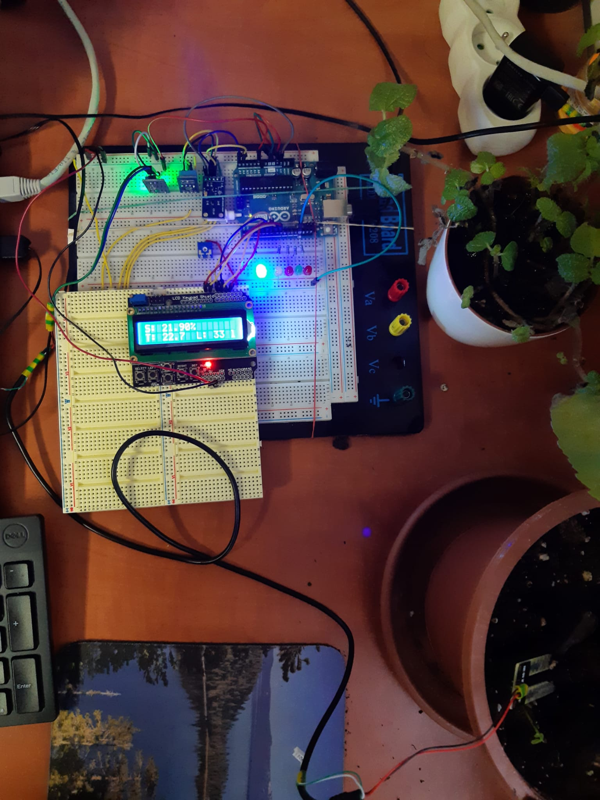

# Greenhouse monitoring and control system

### Team members

* Beránková Tereza
* Čermák Václav
* Lungu Masauso

Main Link to the GitHub repository:

[https://github.com/xcerma40/DE2-project-greenhouse](https://github.com/xcerma40/DE2-project-greenhouse)

sub Link to the GitHub repository:(streamlined version)

[https://github.com/Masauso-L/Digital-electronis-2/tree/main/Labs/project-1](https://github.com/Masauso-L/Digital-electronis-2/tree/main/Labs/project-1)

### Table of contents

* [Project objectives](#objectives)
* [Hardware description](#hardware)
* [Libraries description](#libs)
* [Main application](#main)
* [Video](#video)
* [References](#references)

## Project objectives

See main repository

## Hardware description

*on main repository*

## Libraries description

*on main repository*

## Main application

for streamlined version check here 

* **displaying data on uart**

* **reading soil moisture in plant with less water**

* **reading soil moisture in plant with excess water**

## Video
 video for streamlined version
main video check the link in the main repositor

## References

*check main repository*